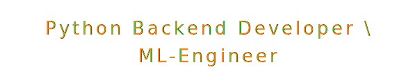

<!---->

<!---->

&#8203;
<pre>
 ,-.       _,---._ __  / \
 /  )    .-'       `./ /   \
 (  (   ,'            `/    /|
  \  `-"             \'\   / |
   `.              ,  \ \ /  |
    /`.          ,'-`----Y   |
   (            ;        |   '
  |  ,-.    ,-'         |  /
 |  | (   |   my repos | /
)  |  \  `.___________|/
`--'   `--' &nbsp; &nbsp; &nbsp; &nbsp; &nbsp; &nbsp;
</pre>

<!---->

<!---->

<!--
**Delshi/Delshi** is a ✨ _special_ ✨ repository because its `README.md` (this file) appears on your GitHub profile.

Here are some ideas to get you started:

- 🔭 I’m currently working on ...
- 🌱 I’m currently learning ...
- 👯 I’m looking to collaborate on ...
- 🤔 I’m looking for help with ...
- 💬 Ask me about ...
- 📫 How to reach me: ...
- 😄 Pronouns: ...
- ⚡ Fun fact: ...
-->

 
